# Tau — Rust 重写架构方案

> Rust stable · tokio · cargo workspace · Rust 2024 edition · 不复制 Python 结构 · idiomatic Rust

本文件是 huggingface/tau（Python）到 Rust 重写的总体架构设计与全套迁移计划。它基于对原项目三个包（`tau_ai` ≈4.1k 行、`tau_agent` ≈1.7k 行、`tau_coding` ≈25.7k 行）全部核心源码的通读产出。

> **当前状态**: Phase 1-7 全部完成（含 5.1-5.8、6 REPL、7 ratatui TUI）。测试全绿：默认 **200**、`--features tui` **205**（TUI 测试仅在 `tui` feature 下编译）；clippy 与 `fmt` 干净（TUI 置于 `feature = "tui"`，默认不编译）。已用真实 OpenCode 免费模型端到端验证（LRU crate 10/10、resume 18/18、429 退避、wire 双向兼容 golden）。TUI 经 5 轮 bug 修复（重复消息、光标 Unicode panic、输入不清空、滚动），已达可用状态。剩余为 Phase 8（OAuth / 更多 provider / skills / 扩展）。详见文末 §6 与 §4。

范围决策（已确认）：

| 决策项 | 选择 |
|---|---|
| 数据兼容性 | 完全兼容现有 `~/.tau/` 数据（sessions JSONL、providers.json、credentials.json、catalog.toml、tui.json），serde 模型严格对齐 Pi wire 格式，两个实现可交替 |
| Provider 范围 | 先 Anthropic + OpenAI 兼容（覆盖 catalog 中 28 个 provider 的绝大多数） |
| 扩展系统 | v1 砍除动态加载，预留 trait 边界（hook 点全部保留） |
| TUI 范围 | print 模式 + 简洁交互优先；ratatui 全量 TUI 后置 |

---

# 0. 分析结论速览

| 维度 | 结论 |
|---|---|
| 真实依赖方向 | `tau_agent` 是核心（拥有 provider 契约）；`tau_ai` 依赖它实现适配器；`tau_coding` 组合两者。README 写的 `tau_coding → tau_agent → tau_ai` 是概念分层，代码里 `tau_ai.provider` 只是 re-export `tau_agent.provider` |
| 代码量 | `tau_agent` ≈1.7k 行，`tau_ai` ≈4.1k 行，`tau_coding` ≈25.7k 行（其中 TUI 占 9.2k），测试 ≈24.8k 行 |
| 移植甜点 | 数据模型（pydantic → serde tagged enum）在 Rust 中反而**更干净**；session replay、truncation、edit 校验是纯函数，直接迁移 |
| 最大重新设计点 | ① Python 动态扩展加载 → 静态 trait（v1 砍除）② Textual TUI → ratatui（后置）③ async generator → Stream（语义可完全保留，需选对模式） |
| 兼容性关键 | `~/.tau` 已有真实数据：serde 模型必须严格对齐 Pi wire 格式（camelCase alias + `role`/`type` 判别标签 + v1 session 迁移逻辑） |

---

# 1. Python 项目架构图

## 1.1 整体分层与依赖

```mermaid
graph TD
    subgraph tau_coding["tau_coding ≈25.7k行 — 编码应用层"]
        CLI[cli.py typer入口/模式分发]
        TUI[tui/ Textual App 9.2k行]
        RND[rendering/ print渲染器]
        SES[session.py CodingSession 2.6k行 组合根]
        TOOLS[tools.py read/write/edit/bash]
        CTX[context/context_window system_prompt/skills prompt_templates/resources]
        PCFG[provider_config 2.3k行 catalog_loader/provider_runtime]
        CRED[credentials+oauth_* FileCredentialStore/PKCE/device]
        CMD[commands.py 17斜杠命令]
        SMGR[session_manager session_export]
        EXT[extensions/ 动态Python插件 2.3k行]
    end

    subgraph tau_agent["tau_agent ≈1.7k行 — 可移植大脑 契约所在"]
        MSG[messages.py WireModel+AgentMessage联合]
        EV[events.py+provider_events.py AgentEvent/AssistantMessageEvent]
        TDEF[tools.py AgentTool/AgentToolResult]
        PROT[provider.py ModelProvider Protocol]
        LOOP[loop.py run_agent_loop]
        HAR[harness.py AgentHarness 有状态封装]
        SMOD[session/ entries/tree/memory/jsonl]
    end

    subgraph tau_ai["tau_ai ≈4.1k行 — provider适配层"]
        ANTH[anthropic.py 496]
        OAIC[openai_compatible.py 1126 completions+responses]
        CODEX[openai_codex.py 848]
        GOOG[google.py 439]
        MIST[mistral.py 450]
        FAKE[fake.py 测试用确定性provider]
        STRM[stream.py canonicalize_provider_stream]
        RETRY[retry.py/http.py 退避/代理规整]
    end

    CLI --> SES
    TUI --> SES
    RND --> SES
    SES --> TOOLS & CTX & CMD & SMGR & EXT
    SES --> HAR
    PCFG --> CRED
    PCFG --> ANTH & OAIC & CODEX & GOOG & MIST
    SES --> PCFG

    HAR --> LOOP
    LOOP --> PROT & MSG & EV & TDEF
    HAR --> SMOD
    SMOD --> MSG

    ANTH & OAIC & CODEX & GOOG & MIST --> STRM --> EV
    ANTH & OAIC & CODEX & GOOG & MIST --> RETRY
    ANTH & OAIC & CODEX & GOOG & MIST -.实现.-> PROT

    style PROT fill:#f96,stroke:#333
    style SES fill:#9cf,stroke:#333
```



两个关键事实：
1. `ModelProvider` Protocol 由 `tau_agent` **拥有**，`tau_ai` 只是实现方——Rust 里 trait 必须定义在 core crate。
2. `CodingSession` 是整个应用的**组合根**（2.6k 行），它把 harness、工具、持久化、压缩、扩展运行时缝在一起；Python 里它没使用 harness 的 `before/after_tool_call` 钩子，而是通过扩展运行时**包裹每个工具的 execute_fn** 来实现拦截——这个细节必须在 Rust 里保留同样的接缝位置。

## 1.2 核心模块划分

| 模块 | 职责 | 纯度 |
|---|---|---|
| `messages.py` | Pi wire 数据模型：7 种 message（`role` 判别）+ 4 种 content block + Usage | 纯数据 |
| `provider_events.py` | 12 种 assistant 流事件（`type` 判别），含 `partial` 快照 | 纯数据 |
| `events.py` | 10 种 agent 循环事件（`type` 判别） | 纯数据 |
| `tools.py` (agent) | `AgentTool` = schema + async executor + 渲染钩子 + prompt 元数据 | 数据+协议 |
| `loop.py` | 无状态 turn 循环：assistant 流 → 工具执行 → steering/follow-up 排空 → 终止条件 | 纯逻辑（async） |
| `harness.py` | 有状态封装：消息列表、监听器、取消令牌、双队列（one_at_a_time/all）、中断修复 | 纯逻辑（async） |
| `session/*` | 9 种 append-only entry → 树遍历 → 状态重放（compaction 应用）→ JSONL + v1 迁移 | 纯逻辑+IO |
| `stream.py` (ai) | 内部 `ProviderEvent` → 规范 `AssistantMessageEvent` 的有状态转换器 | 纯逻辑（async） |
| 各 provider | SSE 解析 → 内部事件；指数退避重试（408/409/425/429/5xx + 网络错误且未产出内容时） | IO |
| `tools.py` (coding) | 4 个内置工具，语义极精确 | IO |
| `session.py` (coding) | 持久化、compaction（手动/阈值/溢出+单次重试）、自动命名、模型切换、分支、reload | 组合 |
| `provider_config` | catalog.toml（28 provider）+ providers.json + 凭证解析链 | 配置 |
| `tui/` | Textual 前端；`TuiEventAdapter.apply()` 是**纯函数** event→state mutation | UI |

## 1.3 Agent 生命周期

```
启动:  CLI 分发 → 加载 providers.json/catalog.toml/credentials → 构建 provider
      → SessionManager prepare/create（per-project 目录 + index.jsonl）
      → CodingSession.load:
          storage.read_all() → SessionState.from_entries(重放+compaction)
          → 加载 AGENTS.md/skills/templates → 创建工具 → 扩展包装
          → build_system_prompt → AgentHarness(恢复的消息)
          → 修复悬空 tool_call（补 "interrupted" ToolResultMessage）
运行:  prompt(text)
      → input hooks（扩展可 transform/handle）
      → 模板展开 /skill:name 展开
      → 若运行中 → steer/follow_up 入队 + QueueUpdateEvent
      → 自动 compaction 检查（pre）
      → harness.prompt_message → run_agent_loop:
          AgentStart → TurnStart →
          [provider 流 → MessageStart/Update*/End(assistant)]
          → 按序执行每个 tool_call [ToolExecutionStart/Update*/End + ToolResult 消息]
          → TurnEnd → 排空 steering → 下一 turn …
          → 无工具且无队列 → 排空 follow_up → AgentEnd
      → 每事件副作用：message_end 时追加 MessageEntry+LeafEntry；
        首条 user 消息后自动命名（旁路 provider 调用）；
        stop_reason==error 且匹配溢出模式 → compaction + 单次重试
      → 自动 compaction 检查（post）→ AgentSettledEvent
切换:  set_model/set_provider → 重建 runtime provider → 持久化偏好 → 追加 ModelChange/ThinkingLevelChange entry
分支:  branch_to_entry/resume/new → 新 CodingSession.load 共享扩展运行时 → adopt_replacement(shutdown→swap→start)
退出:  aclose → session_shutdown 钩子 → 关闭自有 provider
```

## 1.4 数据流与控制流

```
数据流（下行）:  provider SSE 字节流
  → ProviderEvent（内部: text_delta/thinking_delta/tool_call/retry/end/error）
  → canonicalize_provider_stream（累积 partial、补 start/end 对、定 stop_reason）
  → AssistantMessageEvent（规范 Pi 流，带 partial 深拷贝快照）
  → run_agent_loop（包成 Message/ToolExecution/Turn 事件，消息写回上下文列表）
  → AgentEvent
  → CodingSession（+持久化副作用，包成 CodingSessionEvent）
  → TuiEventAdapter(纯) / TranscriptRenderer / JsonEventRenderer

控制流（上行）:  cancel() → CancellationToken.is_cancelled 在 SSE 循环/工具轮询/重试等待三处检查
               steer()/follow_up() → 队列 → 循环边界排空（非中断式）
               compaction → 替换 harness 消息（replace_messages）
```

关键语义：**拉取式（pull-based）流**。Python async generator 的消费速度由下游决定；取消 = generator 被 close。Rust 迁移必须保留拉取式语义。

## 1.5 第三方依赖及 Rust 替代

| Python | 用途 | Rust 替代 |
|---|---|---|
| pydantic | wire 模型、判别联合、alias、extra=forbid | **serde + serde_json**（`#[serde(tag, rename_all="camelCase", deny_unknown_fields)]`） |
| httpx[socks] | async HTTP + SSE + 代理 | **reqwest**（stream feature，socks5 feature） |
| anyio | async 运行时抽象 | **tokio** |
| （手写 SSE 解析） | `data:` 行解析 | `tokio::io::AsyncBufReadExt::lines` |
| typer | CLI | **clap**（derive） |
| textual + rich | TUI + 渲染 | **ratatui + crossterm**（后期）；print 模式用纯文本 |
| pygments | HTML 导出代码高亮 | **syntect** |
| packaging | 版本比较 | **semver** |
| tomllib | catalog.toml | **toml** crate |
| tempfile/os.killpg | bash 工具 | `tempfile`、`nix::killpg` 或 `command-group` |
| uuid | entry id | **uuid** v4 |
| difflib | edit diff / patch | **similar** |
| 浏览器 OAuth | webbrowser + localhost server + JWT | **webbrowser** + 微型 HTTP server + **jsonwebtoken** |

---

# 2. Rust 重构架构设计

## 2.1 Crate 划分（cargo workspace）

```
tau-rs/
├── Cargo.toml            # workspace
├── crates/
│   ├── tau-types/        # ★ wire 契约：messages, events, provider_events,
│   │                     #   session entries, AgentToolResult, Usage
│   │                     #   依赖仅 serde/serde_json — 无 async, 无 tokio
│   ├── tau-agent/        # ★ 大脑：provider trait, tool executor trait, loop, harness,
│   │                     #   session tree/replay/jsonl 存储, FakeProvider(测试 feature)
│   │                     #   依赖 tau-types + futures + async-stream + tokio-util
│   ├── tau-ai/           # provider 适配（phase 2）：anthropic, openai-compatible,
│   │                     #   stream canonicalizer, retry, http, fake(测试 feature)
│   │                     #   依赖 tau-agent + reqwest
│   ├── tau-coding/       # 应用服务（phase 3+）：内置工具 read/write/edit/bash,
│   │                     #   session 持久化 (JsonlSessionStorage, SessionManager),
│   │                     #   catalog 深度合并, context/system_prompt/skills,
│   │                     #   CodingSession, commands, compaction,
│   │                     #   credentials, session_manager/export
│   └── tau-cli/          # 二进制 tau-rs（phase 5+）：clap 入口, print 渲染器,
                          #   REPL(rustyline), 后期 ratatui TUI(feature "tui")
```

理由：
- `tau-types` 独立 → 编译快、契约可被任何前端/embed 复用，且**编译期保证**核心不依赖 HTTP/UI（对应 Python 的 "keep the core portable" 纪律，Rust 用 crate 边界强制执行，比 Python 的约定更强）。
- `tau-agent` 不依赖 reqwest → provider trait 的对象安全实现可以在无 HTTP 环境测试。
- 与原三层结构一一对应，但修正了真实的依赖方向（`tau-ai` 依赖 `tau-agent`，反向不成立）。

Phase 1 只产出 `tau-types` 与 `tau-agent` 两个 crate。

## 2.2 module 结构

```
tau-types/src/
├── lib.rs              # 模块导出 + prelude
├── message.rs           # content blocks, 7 messages, Usage, StopReason, helpers
├── event.rs             # AgentEvent (10 variants)
├── provider_event.rs    # AssistantMessageEvent (12 variants)
├── tool_result.rs       # AgentToolResult
└── session.rs           # SessionEntry (9 variants) + 标签/时间戳

tau-agent/src/
├── lib.rs
├── provider.rs          # ModelProvider trait + StreamRequest + CancellationToken
├── tool.rs             # AgentTool, ToolExecutor, ToolError, hooks, render types
├── agent_loop.rs        # run_agent_loop (pure stream, &mut Vec<AgentMessage>)
├── harness.rs           # AgentHarness (Arc<HarnessState> shared + Drop-guard cleanup)
├── session/
│   ├── mod.rs
│   ├── tree.rs          # path_to_entry, entries_by_id
│   ├── state.rs         # SessionState::from_entries (replay + compaction)
│   └── jsonl.rs         # entry_to/from_json_line + v1 migration
└── testing.rs           # FakeProvider (cfg feature "testing")

tau-coding/src/           # Phase 3+
├── lib.rs
├── tools/
│   ├── mod.rs           # create_coding_tools() -> Vec<AgentTool>
│   ├── read.rs          # read 工具
│   ├── write.rs         # write 工具
│   ├── edit.rs          # edit 工具
│   └── bash.rs          # bash 工具
├── session/
│   ├── mod.rs
│   ├── storage.rs       # JsonlSessionStorage (JSONL I/O)
│   └── manager.rs       # SessionManager (目录管理)
└── config/
    └── catalog.rs       # catalog 深度合并
```

## 2.3 Trait 设计

```rust
// tau-agent: provider 契约（对应 ModelProvider Protocol）
// 返回 BoxStream（拉取式），保留 generator 语义（含 drop-即-取消）
pub trait ModelProvider: Send + Sync {
    fn stream_response<'a>(
        &'a self,
        request: &'a StreamRequest<'a>,
    ) -> BoxStream<'a, AssistantMessageEvent>;
}

pub struct StreamRequest<'a> {
    pub model: &'a str,
    pub system: &'a str,
    pub messages: &'a [AgentMessage],
    pub tools: &'a [AgentTool],
    pub signal: Option<CancellationToken>,
}

// tau-agent: 工具执行（对应 ToolExecutor Protocol）
#[async_trait]
pub trait ToolExecutor: Send + Sync {
    async fn execute(
        &self,
        tool_call_id: &str,
        arguments: &serde_json::Map<String, Value>,
        signal: Option<CancellationToken>,
        on_update: Option<&dyn Fn(AgentToolResult) + Send + Sync>,
    ) -> Result<AgentToolResult, ToolError>;
}

pub struct AgentTool {
    pub name: Arc<str>,               // Arc<str> 支持动态工具名（ADR-7）
    pub label: String,
    pub description: String,
    pub parameters: serde_json::Value,
    pub executor: Arc<dyn ToolExecutor>,
    pub prompt_snippet: Option<String>,
    pub prompt_guidelines: Vec<String>,
    pub prepare_arguments: Option<Arc<dyn Fn(&Value) -> Map<String, Value> + Send + Sync>>,
    pub execution_mode: ToolExecutionMode,
    pub render_call: Option<Arc<dyn Fn(&Map<String, Value>) -> Option<String> + Send + Sync>>,
    pub render_result: Option<Arc<dyn Fn(&AgentToolResult, bool) -> Option<String> + Send + Sync>>,
}

// tau-agent: agent loop（纯函数，可单独测试）
pub struct LoopArgs<'a> {
    pub provider: &'a (dyn ModelProvider + Send + Sync),
    pub model: &'a str,
    pub system: &'a str,
    pub messages: &'a mut Vec<AgentMessage>,
    pub tools: &'a [AgentTool],
    pub prompts: &'a [AgentMessage],
    pub max_turns: Option<u32>,
    pub signal: Option<CancellationToken>,
    pub get_steering_messages: Option<&'a mut (dyn FnMut() -> Vec<AgentMessage> + Send)>,
    pub get_follow_up_messages: Option<&'a mut (dyn FnMut() -> Vec<AgentMessage> + Send)>,
    pub before_tool_call: Option<&'a (dyn BeforeToolCall + Send + Sync)>,
    pub after_tool_call: Option<&'a (dyn AfterToolCall + Send + Sync)>,
}
pub fn run_agent_loop(args: LoopArgs<'_>) -> impl Stream<Item = AgentEvent> + Send + '_;
```

## 2.4 Async runtime：tokio

理由：
- reqwest、tokio::process（bash 工具需要 `process_group(0)` + killpg 语义 + 取消），tokio::fs，tokio::time 退避，全部一线支持。
- Python 的轮询式取消（每 50ms 检查 token）在 Rust 中改为 `tokio::select! { _ = token.cancelled() => …, out = child.wait_with_output() => … }`，行为等价且即时。
- 拉取式流语义用 `async-stream::stream!`（async generator）+ `futures::StreamExt::next`，忠实复刻 Python generator 控制流。

## 2.5 Harness 设计（关键 ADR，详见 phase-1.md）

`AgentHarness` 采用 `Arc<HarnessState>` 内部共享状态：
- `prompt(&self) -> Result<impl Stream + Send + 'static>`：返回不借用 `&self` 的流，从而 `steer()/follow_up()/cancel()`（均 `&self`）可在运行中并发调用——对齐 Python `test_harness_rejects_overlap` 的并发语义。
- 消息在运行期从共享状态 `mem::take` 取出、纯 `run_agent_loop` 借用 `&mut`、Drop guard 归还（早退/正常完成都安全）。
- 取消、监听器、运行标志全部在共享状态；监听器支持 sync 与 async 两种。
- 这是对 Python "harness 对象同时做流源与控制面板"的 Rust 化：用 Arc 共享而非同一对象别名，编译期而非运行时保障安全。

## 2.6 Error handling

分层策略——**关键认知：tau 协议中错误大多是数据而不是异常**：

| 层级 | 方案 |
|---|---|
| 协议内错误 | 保持为**数据**：`AssistantMessage { stop_reason: Error, error_message }`、`ToolResultMessage { is_error: true }`、provider 流以 `AssistantErrorEvent` 收尾——这些**不进 Result** |
| 库错误 | **thiserror**：`SessionJsonlError`、`SessionTreeError`、`ToolError` 等 |
| 工具执行边界 | `Result<AgentToolResult, ToolError>`；loop 捕获 `Err` 转为 error result（对应 Python 的 `except Exception` 隔离语义） |
| CLI 边界 | **anyhow** + 退出码 |
| 永不 panic | session 重放遇坏行 → `SessionJsonlError` 带行号；diagnostics 日志永不失败 |

## 2.7 配置管理

全部**纯 serde**，不引入 figment/config（原项目就是手工分层合并）：

| 文件 | crate | 要点 |
|---|---|---|
| `data/catalog.toml` + `~/.tau/catalog.toml` | `toml` + serde | `deny_unknown_fields`；overlay 深合并逐条复刻 |
| `providers.json` / `credentials.json` / `settings.json` / `tui.json` | `serde_json` | camelCase alias + snake_case 兼容读取 |
| 会话 `*.jsonl` / `index.jsonl` | `serde_json` 逐行 | 追加写；**v1 迁移逻辑**在反序列化前对 `Value` 做变换，完全复刻 `jsonl.py` |
| 原子写 | `tempfile` + `fs::rename` + 0600 权限 | 含 `.bak` 备份 |
| 路径 | `dirs` crate | `TauPaths` 支持 env 覆盖 |

---

# 3. Python → Rust 映射表

## 3.1 数据模型（tau-types，serde 严格对齐 Pi wire）

| Python | Rust |
|---|---|
| `Annotated[User\|Assistant\|..., Field(discriminator="role")]` | `#[serde(tag="role")] enum AgentMessage`（7 变体，手动 Deserialize 透传严格性；Serialize 派生） |
| `Annotated[Text\|Thinking\|ToolCall, discriminator="type"]` | `#[serde(tag="type", rename_all="camelCase")] enum AssistantContent`（手动 Deserialize） |
| `UserContent = str \| list[Text\|Image]` | `#[serde(untagged)] enum UserContent` |
| `StopReason = Literal[...]` | `#[serde(rename_all="camelCase")] enum StopReason` |
| `JSONValue` | `serde_json::Value` |
| `model_validator` 字符串 content 便利构造 | 不进 Deserialize；提供 `AssistantMessage::from_text()` 构造器 |
| wire 上 `extra="forbid"` | 手写 `Deserialize`：先解析为 `Value`，按 tag 分派到严格 `from_value::<Variant>`（绕开 internally-tagged 不支持 deny_unknown_fields 的 serde 限制） |
| `exclude_none=True` 序列化 | 所有 Option 字段 `#[serde(skip_serializing_if = "Option::is_none")]`；`Value` 字段 `skip_serializing_if = "Value::is_null"` |
| JSON key 顺序 = 声明顺序 | 结构体字段按 Python 声明顺序；`serde_json/preserve_order` 启用 |
| `partial: AssistantMessage`（事件快照，深拷贝） | `Arc<AssistantMessage>`（事件克隆 O(1)，序列化透明，serde "rc" feature） |
| `@property text / thinking_text / tool_calls` | `impl` 方法返回 `String` / `impl Iterator` |

## 3.2 行为抽象（tau-agent）

| Python | Rust |
|---|---|
| `class ModelProvider(Protocol)` | `trait ModelProvider: Send + Sync`（返回 `BoxStream`，非 async fn，对象安全无需 async_trait） |
| `async def run_agent_loop(...) -> AsyncIterator[AgentEvent]` | `fn run_agent_loop(LoopArgs) -> impl Stream + Send + '_`（async_stream，控制流逐行对应） |
| `class AgentHarness`（状态+队列+监听器+取消） | `struct AgentHarness { config, state: Arc<HarnessState> }`，`prompt(&self) -> Result<impl Stream + 'static>`；监听器 `Vec<Arc<dyn Fn(&AgentEvent) + Send + Sync>>` |
| `CancellationToken / ToolCancellationToken Protocol` | `tokio_util::sync::CancellationToken`（具体类型，clone 共享） |
| `class AgentTool` dataclass + `execute_fn` 可调用 | `struct AgentTool { executor: Arc<dyn ToolExecutor>, ... }`，`Clone`（Arc） |
| `BeforeToolCall / AfterToolCall` 钩子类型别名 | `trait BeforeToolCall/AfterToolCall: Send + Sync` with `fn call(&self, ...) -> BoxFuture<'_, ...>` (trait 形式比 HRTB function type 更惯用，且支持状态化实现) |
| `SessionState.from_entries` 类方法（含 sentinel `_UNSET_LEAF_ID`） | `SessionState::from_entries(&[SessionEntry], LeafSelector) -> Result<Self>`，`LeafSelector::{Linear, At(Option<&str>)}` |
| `entry_to/from_json_line` + v1 迁移 | `entry_to_json_line / entry_from_json_line` + `migrate_entry(Value) -> Value` |
| `FakeProvider`（重放预定义流） | `struct FakeProvider { streams: Mutex<VecDeque<...>>, calls: Mutex<Vec<ProviderCall>> }`，`tau-agent` feature `testing` |

## 3.3 应用层（tau-coding / tau-cli，后续 phase）

| Python | Rust |
|---|---|
| `class CodingSession`（组合根） | `struct CodingSession` |
| `create_coding_tools(cwd, shell_prefix)` → 4 工具 | 同名函数；bash 用 `tokio::process::Command` + `process_group(0)` + `select!` 取消/超时 |
| `_file_locks` 模块全局 dict | `static FILE_LOCKS: LazyLock<DashMap<PathBuf, Arc<Mutex<()>>>>` |
| `ExtensionAPI`（动态 setup(tau)） | `trait ExtensionRuntime` + `NoopExtensionRuntime`；动态加载不存在（设计性砍除） |
| `TuiEventAdapter.apply` 纯函数 | `fn apply(state: &mut TuiState, ev: &CodingSessionEvent)`（最易移植部分之一） |
| `...Renderer` 三种 print 模式 | `trait EventRenderer` 三实现 |

---

# 4. 分阶段迁移计划

原则：**每阶段 `cargo build && cargo test` 全绿；从 Phase 3 起二进制保持可运行；wire 兼容性用真实 `~/.tau` 数据与 Python 生成的 golden 文件双重验证。**

## Phase 0 — 工程骨架
workspace、空 crate、toolchain、CI（fmt/clippy/test）。验证：`cargo build`。

## Phase 1 — tau-types + tau-agent 核心 ★
全部 wire 模型、事件、session entries/tree/replay/jsonl（含 v1 迁移）、`ModelProvider`/`ToolExecutor` trait、`run_agent_loop`、`AgentHarness`、`FakeProvider`。
验证：移植 `test_agent_loop.py` / `test_agent_harness.py`；golden 逐字节对比；遍历真实 `~/.tau/sessions` 全部行可解析。详见 `docs/phase-1.md`。

## Phase 2 — tau-ai：HTTP + 两个 provider
reqwest 客户端（代理规整）、手写 SSE 行解析、retry/退避、`canonicalize_provider_stream`、AnthropicProvider、OpenAICompatibleProvider（chat completions 先行）。
验证：wiremock mock server + 从 Python 抓取的 SSE fixture → 事件流一致。

## Phase 3 — 内置工具（✅ 已完成 2026-07-19）
`tau-coding` crate：`read`/`write`/`edit`/`bash` 四个核心工具（进程组 kill、路径锁、CRLF/BOM 保留），CLI 集成通过 `AgentHarness` 运行。
验证：`tau-coding` 17 个单元测试全绿；CLI `--print` 模式通过 harness 执行工具调用。详见 `docs/phase-3.md`。

## Phase 4 — 配置与持久化（✅ 已完成 2026-07-19）
`JsonlSessionStorage`（session 文件读写）、`SessionManager`（session 目录管理）、catalog 深度合并、CLI 集成 session 持久化。
 验证：storage 6 + manager 7 + catalog 8 = 21 测试（见 §6.4 与 `docs/phase-4.md`）；session 文件格式与 Python 兼容；内置 catalog 通过 `include_str!` 嵌入，合并逻辑对齐 Python catalog loader。详见 `docs/phase-4.md`。

## Phase 5 — CodingSession + print 模式端到端 ★ 第一个用户可见里程碑（✅ 已完成 2026-07-19, 5.1–5.8）
- 5.1 `CodingSession` 组合根接入 CLI，parent_id 链持久化（issue #3/#10 关闭）
- 5.2 `load`/resume、`--resume` CLI、中断 tool_call 修复（in-memory）
- 5.3 compaction 三触发（阈值/手动/溢出+单次重试）+ LLM 摘要
- 5.4 自动命名（`naming.rs`）、斜杠命令（`commands.rs`）、`!`/`!!` shell escape、harness `set_model`/`set_provider`/`clear_messages`
- 5.5 三渲染器 plain/json/transcript（`render/mod.rs`）+ `EventRenderer` trait + 工具 `render_call`/`render_result`，`--format` 开关
- 5.6 双向兼容 golden（`test_compat.rs`）：Rust 序列化逐字节 round-trip + Python v2 fixture 解析 + v1 迁移 + resume 重建
- 5.7 真实 API 端到端验证，修复 `model:"unknown"` 持久化（#17）与 opencode key 名（#18）
- 5.8 429 限流专用退避 + `Retry-After` 支持 + 默认 `max_retries` 5，opencode 默认模型改 `nemotron-3-ultra-free`

验证：`tau-rs -p "..."` 跑通并落盘 session；同一 session 文件可被 Python `tau` resume（双向兼容终极验证，5.6 已锁）；真实免费模型多轮工具循环 18/18 测试通过。

## Phase 6 — 简洁交互 REPL（✅ 已完成 2026-07-19）
将 `tau-cli/src/main.rs` 原朴素 `stdin().lock().lines()` REPL 升级为 **rustyline** 驱动（见 `repl.rs`）：持久化历史（`~/.tau/history`）、Tab 补全（斜杠命令 / 工具名 / 本地文件路径）、`/thinking` 切换、`Ctrl-C` 清上下文、`Ctrl-D` 退出。thinking level 经 `StreamRequest.thinking_level` 透传，由 provider 翻译为 `reasoning_effort`（OpenAI 兼容）或 Anthropic adaptive effort——架构改动点已在 6.3 落地。

### 6.1 目标能力（来自原版 `CodingSession.prompt` / `run_terminal_command`）
- 流式输出 + `Esc` 取消（`CancellationToken` 已就绪，harness 支持 `cancel()`）
- `Enter` = 新 prompt；运行中 `Enter` = **steer**（harness `steer()`）、`Alt+Enter` = **follow_up**（harness `follow_up()`）—— 原版 `prompt()` 已用 `streaming_behavior` 区分，Rust harness 已有 `steer`/`follow_up` 队列
- 历史记录（持久化到 `~/.tau/history`）、行内自动补全（工具名 + 斜杠命令）
- 斜杠命令已落地（`commands.rs`：`/help` `/exit` `/clear` `/compact` `/model` `/provider`），REPL 仅需接上 rustyline 的 command 补全
- thinking level 切换：原版 `set_thinking_level` / `cycle_thinking_level`；catalog 已含 `thinking_levels`/`thinking_parameter`，需在 REPL 暴露 `/thinking` 并把 `thinking_level` 透传到 `StreamRequest`（当前 `StreamRequest` 无 thinking 字段 → **架构改动点**）

### 6.2 模块草图
```
tau-cli/src/repl/
  mod.rs          # rustyline Editor 封装，输出重定向到 renderer
  commands.rs     # 复用 tau-coding::commands
  history.rs      # 历史持久化
```
`CodingSession` 已提供 `prompt() -> Stream`（5.1）、`cancel()`（5.2 中断修复）、`set_model`/`set_provider`（5.4），REPL 只做 I/O 编排，不触碰协议。

### 6.3 架构改动点（已在 Phase 6 落地）
- `StreamRequest`（`tau-agent`）已含 `thinking_level: Option<&str>`，由 provider 适配层翻译为 catalog 的 `thinking_parameter`（如 OpenAI 兼容 → `reasoning_effort`，Anthropic → adaptive effort）。`/thinking [level]` 命令经 `CodingSession::set_thinking_level` 写入，并在 `prompt()` 时透传。原版 `ThinkingLevel` 枚举 + `_sync_thinking_level_to_active_model` 的等效逻辑在 `tau-coding::commands` + `CodingSession` 中以简化形式落地（见 Phase 6 节与 §8.1 的已知差距）。
- 当前 `CodingSession::set_model`/`set_provider` 仅改内存（issue #16 推迟）；REPL 的 `/model` `/provider` 切换应按原版 `_persist_default_model_choice` 落盘 `providers.json` 偏好 + 追加 `ModelChangeEntry`/`ThinkingLevelChangeEntry`——此项仍为 Phase 8 候选。

## Phase 7 — ratatui TUI（已落地，feature = "tui"）
原版 TUI 是 **6070 行** `tui/app.py` + `adapter.py`（纯 `apply(event)`）+ `state.py` + `widgets.py` + `autocomplete.py`。Rust 端按"纯 adapter 先行"策略落地最小可用子集：

- `tau-cli/src/tui/adapter.rs`：`TuiEventAdapter::apply(&AgentEvent)`，逐事件翻译，无 ratatui 依赖、可单测（5 个单测覆盖 start/end、text/thinking delta、tool、user）。
- `tau-cli/src/tui/state.rs`：`TuiState` + `ChatItem`，对齐 `state.py` 数据模型（tool 折叠/展开、thinking 折叠/展开、branch/compaction summary、resume 回灌 `load_messages`）。
- `tau-cli/src/tui/ui.rs`：ratatui `draw`，transcript（滚动）+ input 行 + status 条三段式布局；role 配色、tool 结果 `Ctrl-O` 切换、thinking `Ctrl-T` 切换。
- `tau-cli/src/tui/app.rs`：crossterm raw-mode + 备屏，`tokio::select!` 桥接按键通道与 `CodingSession::prompt()` 流；steering/cancel 经克隆 `AgentHarness` 句柄（不占 `&mut session`，与活流借用不冲突）。
- 运行：`cargo run --features tui -- --tui`（无 `tui` feature 的普通构建不拉 ratatui）。

### 7.1 移植顺序（对齐原版分层：`TuiEventAdapter.apply` 是纯函数，最易移植）
1. **`TuiState` + `apply(&mut TuiState, &CodingSessionEvent)`**：先把原版 `adapter.py` 的 `apply` 逐事件翻译为 Rust 纯函数（无 ratatui 依赖，可单测）。事件源 = `CodingSession::prompt()` 产出的 `AgentEvent`，经 `EventRenderer` 同款管线。
2. **最小布局**：transcript（滚动消息区）+ prompt 输入行（复用 Phase 6 的 rustyline 或 `tui-textarea`）。
3. **pickers**：model picker（`available_model_choices`）、session tree picker（`tree_choices`）、thinking picker—— 全部由 `CodingSession` 已暴露的只读 getter 驱动。
4. **autocomplete / sidebar / 主题**：最后做。

### 7.2 关键约束（来自原版 AGENTS.md）
> Do not let Textual become a dependency of the reusable agent harness.

Rust 等同约束：**ratatui 只依赖 `tau-types` 事件 + `CodingSession` 只读接口，绝不反向依赖 `tau-agent`/`tau-ai` 的 HTTP**。建议放 `tau-cli` 内的 `feature = "tui"`，默认不编译，保持二进制体积与无 TUI 依赖。

## Phase 8 — 补齐与再评估（待实现）
| 能力 | 原版位置 | Rust 现状 | 建议 |
|------|----------|-----------|------|
| OAuth 交互流 | `oauth*.py`（device/PKCE + localhost server） | 无 | 加 `tau-coding::credentials::oauth`（webbrowser + 微型 axum server + jsonwebtoken）；`providers.json` 已留 `auth_methods` |
| openai-codex provider | `tau_ai/openai_codex.py` (848 行) | catalog 有条目，无适配 | 实现 `OpenAICodexProvider`（OAuth bearer + `backend-api` 端点） |
| google / mistral 适配器 | `google.py`/`mistral.py` | 无 | 复用 `OpenAICompatibleProvider` + catalog `kind` 分流；thinking 映射已在 catalog |
| Anthropic responses API | — | 仅 messages API | 按 catalog `api = "anthropic-messages"` 已区分，按需加 responses |
| skills / 项目 context 文件 | `skills.py`/`context.py` | 无 | `CodingSession` 当前无 `skills()`/`context_files()` getter；system prompt 组装器（`prompt.rs`）需接 `prompt_templates`/`resources` |
| session HTML 导出 | `session_export.py` | `export()` 占位 | 用 `syntect` 高亮，复用 transcript 渲染 |
| 扩展系统 | `extensions/`（动态加载 2.3k 行） | 静态 `NoopExtensionRuntime` | v1 砍除；再评估用 rhai/WASM/子进程 IPC（原版 `ExtensionAPI.setup(tau)` 接缝已以 trait 边界保留） |
| update_check | `update_check.py` | 无 | 低优先，可 `reqwest` 轮询 GitHub release |

### 8.1 与原版的功能差距（架构层面）
原版 `CodingSession` 是 **2662 行**组合根，暴露 ~80 个方法（model scoping、provoder runtime 刷新、skills、context files、branch、reload、diagnostics、session stats、export）。Rust 当前 `coding_session.rs`（807 行）覆盖了核心路径（prompt/load/resume/compaction/naming/repair/commands 接线），但以下**原版能力尚未移植**：
- `branch_to_entry` / `SessionTreeBranchResult`（分支浏览与切换）—— 底层 `SessionState` 树遍历（`tree.rs`）已具备，缺 CLI 暴露
- `skills` / `context_files` / `prompt_templates` / `resources`（系统提示工程素材）
- `reload` / `reload_provider_settings`（热重载扩展与 provider 配置）
- `session_stats` / `resource_diagnostics`（遥测/诊断）
- `export`（HTML/JSON 导出）
- `set_thinking_level` / thinking 枚举（见 Phase 6.3）

这些不是阻塞项——核心 agent 循环、工具、持久化、兼容、真实 API 跑通已全部到位。Phase 8 是"广度"而非"正确性"工作。

---


---

# 5. 第一阶段应该实现什么

**第一阶段 = Phase 1：`tau-types` + `tau-agent` 核心（wire 模型 + 事件 + session 重放 + loop + harness + FakeProvider）。**

五个理由（按重要性排序）：

1. **兼容性风险必须在第一天就引爆。** serde 模型的 tag/alias/默认值/migration 与 Pi wire 格式有细微出入，直到 Phase 5 落盘时才暴露就为时已晚。Phase 1 就用真实 session 文件和 Python golden 输出做逐字节断言，在纯库阶段、无网络无 UI 的干净环境里归零这个风险。

2. **它是唯二被所有下游依赖的层。** provider trait、tool trait、事件类型定义在 Phase 1 定型后，Phase 2（HTTP 适配器）和 Phase 3/5（工具、CodingSession）才能并行开发而不互相阻塞——trait 签名先行是 Rust 多 crate 工程的关键路径。

3. **移植确定性最高、测试反馈最快。** 该层几乎无 IO：loop/harness 由 FakeProvider 驱动，Python 已有现成的确定性测试语料（`test_agent_loop.py` 等）可以逐条翻译。第一周就建立"Python 行为 = Rust 行为"的断言范式。

4. **它覆盖了两个最需要语言语义翻译的难点，且此时复杂度最低。** ① async generator → `impl Stream`（loop 是全项目最复杂的 generator，yield 交织在三层嵌套里）② pydantic 判别联合 → serde tagged enum。在没有 HTTP/进程/终端噪音的环境里解决，调试成本最低。

5. **验证方式客观、无人工判断。** Golden JSON 逐字节对比 + 真实 `~/.tau/sessions` 全量解析 + 移植测试全绿，三条都是机器断言。

明确**不做**的（防 scope creep）：不碰 reqwest/tokio 网络栈、不做任何 CLI、不做工具实现（用 stub 工具测试 loop）、不设计扩展 trait（但保证 `run_agent_loop` 的 `before/after_tool_call` 参数预留，零成本保留 Python 已有的接缝）。

详细的 Phase 1 可执行实现计划见 `docs/phase-1.md`。

---

# 6. Rust 实现状态（2026-07-19）

## 6.1 已完成模块

| Phase | Crate | 模块 | 行数 | 状态 |
|-------|-------|------|------|------|
| 1 | `tau-types` | `message.rs` | ~600 | ✅ 完成 |
| 1 | `tau-types` | `event.rs` | ~110 | ✅ 完成 |
| 1 | `tau-types` | `provider_event.rs` | ~150 | ✅ 完成 |
| 1 | `tau-types` | `session.rs` | ~100 | ✅ 完成 |
| 1 | `tau-types` | `tool_result.rs` | ~50 | ✅ 完成 |
| 1 | `tau-agent` | `provider.rs` | ~40 | ✅ 完成 |
| 1 | `tau-agent` | `tool.rs` | ~150 | ✅ 完成 |
| 1 | `tau-agent` | `agent_loop.rs` | ~340 | ✅ 完成 |
| 1 | `tau-agent` | `harness.rs` | ~490 | ✅ 完成 |
| 1 | `tau-agent` | `session/` | ~570 | ✅ 完成 |
| 1 | `tau-agent` | `testing.rs` | ~170 | ✅ 完成 |
| 2 | `tau-ai` | `anthropic.rs` | ~530 | ✅ 完成 |
| 2 | `tau-ai` | `openai.rs` | ~520 | ✅ 完成 |
| 2 | `tau-ai` | `sse.rs` | ~150 | ✅ 完成 |
| 2 | `tau-ai` | `stream.rs` | ~440 | ✅ 完成 |
| 2 | `tau-ai` | `retry.rs` | ~90 | ✅ 完成 |
| 2 | `tau-ai` | `http.rs` | ~80 | ✅ 完成 |
| 3 | `tau-cli` | `main.rs` | ~465 | ✅ 完成 |
| 3 | `tau-cli` | `config.rs` | ~370 | ✅ 完成 |

## 6.3 已实现模块（测试完成）

| Phase | Crate | 模块 | 说明 | 状态 |
|-------|-------|------|------|------|
| 3 | `tau-coding` | `tools/mod.rs` | `create_coding_tools()` 工厂函数 | ✅ 已完成 |
| 3 | `tau-coding` | `tools/read.rs` | read 工具 | ✅ 已完成 |
| 3 | `tau-coding` | `tools/write.rs` | write 工具 | ✅ 已完成 |
| 3 | `tau-coding` | `tools/edit.rs` | edit 工具 | ✅ 已完成 |
| 3 | `tau-coding` | `tools/bash.rs` | bash 工具 | ✅ 已完成 |
| 4 | `tau-coding` | `session/storage.rs` | `JsonlSessionStorage`：session 文件读写 | ✅ 已完成 |
| 4 | `tau-coding` | `session/manager.rs` | `SessionManager`：session 目录管理 | ✅ 已完成 |
| 4 | `tau-coding` | `config/catalog.rs` | catalog 深度合并 | ✅ 已完成 |
| 5 | `tau-coding` | `session/coding_session.rs` | 组合根：prompt/load/resume/compaction/命名/repair/命令接线（5.1-5.4） | ✅ 已完成 |
| 5 | `tau-coding` | `session/compaction.rs` | compaction 三触发（阈值/手动/溢出+重试）+ LLM 摘要（5.3） | ✅ 已完成 |
| 5 | `tau-coding` | `session/context_window.rs` | context-window token 估算（5.3） | ✅ 已完成 |
| 5 | `tau-coding` | `prompt.rs` | system prompt 组装器（5.4） | ✅ 已完成 |
| 5 | `tau-coding` | `naming.rs` / `commands.rs` / `shell_escape.rs` | 自动命名 / 斜杠命令 / `!` `!!` shell escape（5.4） | ✅ 已完成 |
| 5 | `tau-coding` | `session/repair.rs` | 中断 tool_call 修复（in-memory，5.2） | ✅ 已完成 |
| 5 | `tau-cli` | `render/mod.rs` | 三渲染器 plain/json/transcript + `EventRenderer` trait（5.5） | ✅ 已完成 |
| 5 | `tau-cli` | `main.rs` | print/REPL/resume 全模式 + `--format` + 429 退避（5.1-5.8） | ✅ 已完成 |
| 6 | `tau-cli` | `repl/` | rustyline REPL、持久化历史、命令/工具/路径补全、`/thinking` 切换 | ✅ 已完成 |
| 7 | `tau-cli` | `tui/` | ratatui 终端 UI（纯 adapter 先行，`feature = "tui"`） | ✅ 已完成（最小可用子集） |

## 6.4 测试覆盖

> 下表为分类快照；**权威测试总数以 `cargo test --workspace` 实时结果为准**（默认 **200** / `--features tui` **205**）。随 Phase 迭代各 crate 计数会增长。`tau-types` 新增 7 个 hand-written `Deserialize` proptest 性质测试（见 `docs/review-2026-07-19-2.md` §4）。

| Crate | 单元测试 | 集成测试 | 总计（快照） |
|-------|---------|---------|------|
| `tau-types` | 11 | — | 11 |
| `tau-agent` | 10 | 11 | 21 |
| `tau-ai` | 26 | 10 | 36 |
| `tau-cli` | 11 | 10 | 21 |
| `tau-coding` | 100 | 10 | 110 |
| **总计（快照）** | **158** | **41** | **199** |

> 注：快照总计 199 ≈ 实时 200 的差异来自 doc-test 的统计方式；以 `cargo test --workspace` 输出为准。

### 待实现测试（Phase 4 → 已完成）

Phase 4 测试已全部落地（storage 6 + manager 7 + catalog 8 = 21 测试，已含于 `tau-coding` 单元测试中；各 crate 精确计数随迭代增长，权威总数见 §6.4 与文件头）。

## 6.5 已支持的 Provider

| Provider | 类型 | 默认模型 | 状态 |
|----------|------|----------|------|
| OpenCode | `openai-compatible` | `nemotron-3-ultra-free` | ✅ 真实 API 验证（5.7/5.8） |
| NVIDIA NIM | `openai-compatible` | `deepseek-ai/deepseek-v4-flash` | ✅ 已验证 |
| DeepSeek | `openai-compatible` | `deepseek-v4-flash` | ✅ 已配置 |
| Anthropic | `anthropic` | `claude-sonnet-4` | ✅ 代码完成 |
| OpenAI | `openai` | `gpt-4o` | ✅ 代码完成 |

## 6.6 待实现模块（Phase 6+，按广度排序，非阻塞）

> 核心正确性（agent 循环、工具、持久化、兼容、真实 API）已全部到位。下表中"原版缺口"指相对 `huggingface/tau` 原版 `CodingSession`（2662 行）尚未移植的能力，多数为"广度"工作。

| Phase | 模块 | 原版对应 | 状态 |
|-------|------|----------|------|
| 6 | `tau-cli/src/repl/` | `cli.py::run_print_mode` / `run_openai_print_mode` 交互分支 | ✅ 已完成 |
| 6 | thinking level 切换 | `session.py::set_thinking_level` / `thinking.py` | ✅ 已完成（`StreamRequest.thinking_level` → `reasoning_effort` / Anthropic adaptive） |
| 7 | `tau-cli/src/tui/` | `tui/app.py` (6070) + `adapter.py`(纯) + `state.py` | ✅ 已完成（`adapter`/`state`/`ui`/`app` 四件套，对齐分层） |
| 8 | `credentials::oauth` | `oauth*.py`（device/PKCE） | ⏳ 待实现 |
| 8 | `OpenAICodexProvider` | `tau_ai/openai_codex.py` | ⏳ 待实现 |
| 8 | google / mistral 适配器 | `google.py` / `mistral.py` | ⏳ 待实现（catalog `kind` 已分流） |
| 8 | skills / context_files / prompt_templates / resources | `skills.py` / `context.py` | ⏳ 待实现 |
| 8 | `branch_to_entry` / `SessionTreeBranchResult` | `session.py` 分支浏览 | ⏳ 待实现（底层树遍历已具备） |
| 8 | `reload` / `reload_provider_settings` | `session.py::reload` | ⏳ 待实现 |
| 8 | `session_stats` / `resource_diagnostics` | `session.py` 遥测 | ⏳ 待实现 |
| 8 | `export`（HTML/JSON） | `session_export.py` | ⏳ 待实现（用 `syntect`） |
| 8 | 扩展系统 | `extensions/`（动态加载 2.3k） | ⏳ v1 砍除，再评估 rhai/WASM/IPC |
| 8 | `update_check` | `update_check.py` | ⏳ 低优先 |

## 6.7 与 Python 原版的关键差异

| 维度 | Python | Rust | 影响 |
|------|--------|------|------|
| 扩展系统 | 动态 Python 插件 | 静态 trait（v1） | 功能受限，但更安全 |
| TUI | Textual | ratatui（planned） | 需重写 |
| 异步模型 | async generator | `impl Stream` | 语义等价 |
| 错误处理 | exceptions | `Result` + `thiserror` | 更严格 |
| 并发 | GIL + threading | 真并行 | 性能提升 |

---

# 7. 架构深度剖析：Rust 重写 vs Python 原版

> 本节基于对 `huggingface/tau` 原版（Phase 8 之前）三包**全部核心源码**的通读，与 `tau-rs` 当前（Phase 5.8）实现的逐层比对。目标不是逐文件对照，而是**在架构原则层面**说明：哪些被忠实战留、哪些被有意改进、哪些被推迟、以及为什么。

## 7.1 分层与依赖方向（核心原则被严格执行）

原版 `AGENTS.md` 明确三条铁律：

```
AgentHarness = 可复用的 agent 大脑
AgentSession = 编码 agent 环境
TUI          = 一种可能的前端
```

且 **TUI 不得成为可复用 harness 的依赖**。Rust 用 **cargo crate 边界**把这个约定从"文档纪律"升级为"编译器强制"：

| 原版（约定） | Rust（强制） | 评估 |
|---|---|---|
| `tau_agent` 拥有 `ModelProvider` Protocol，`tau_ai` 只是实现方 | `tau-agent` 定义 trait，`tau-ai` 依赖它；`tau-agent` 不依赖 `tau-ai`/reqwest | ✅ 完全一致，且更强 |
| `tau_coding` 组合 `tau_agent` + `tau_ai` | `tau-coding` 依赖两者，`tau-cli` 依赖 `tau-coding` | ✅ 一致 |
| `CodingSession` 是组合根，缝 harness+工具+持久化+扩展 | `CodingSession`（`tau-coding`）同职责 | ✅ 一致（见 7.3） |
| Textual 不能反向依赖 harness | ratatui 只依赖 `tau-types` 事件 + `CodingSession` 只读接口，置于 `feature="tui"` | ✅ 一致（Phase 7 落地时） |

**结论**：分层是重写中最忠实、也最成功的部分。crate 图与原文 §2.1 设计完全一致，且 Rust 的编译期保证消除了 Python 里"某天有人 import 错方向"的风险。

## 7.2 数据流与控制流（语义完整保留）

原版的"拉取式流"（async generator，消费速度由下游决定，取消 = generator close）是 Pi 架构的灵魂。Rust 用 `async-stream::stream!` + `BoxStream` + `Drop` 语义完整复刻：

- **下行**：provider SSE 字节 → `ProviderEvent`（`tau-ai::stream` canonicalizer）→ `AssistantMessageEvent` → `run_agent_loop` 包成 `AgentEvent` → `CodingSession` 持久化副作用 → renderer。`tau-ai/src/stream.rs`（440 行）对应原版 `tau_ai/stream.py` 的 `canonicalize_provider_stream`，职责一致。
- **上行取消**：原版在 SSE 循环 / 工具轮询 / 重试等待三处轮询 token（每 50ms）；Rust 三处均用 `tokio::select! { _ = token.cancelled() => ... }`，行为等价且**即时**（无 50ms 轮询延迟）。`harness.cancel()` 已就绪。
- **steer / follow_up**：原版 `prompt(streaming_behavior=...)` 在运行中入队；Rust `AgentHarness::steer()/follow_up()` 同为 `&self`、经共享 `Arc<HarnessState>` 队列，在循环边界排空——与原文 §2.5 ADR 一致。

**改进点**：原版 `harness` 对象同时是"流源"和"控制面板"（同一对象别名），Rust 改为 `Arc<HarnessState>` 共享，使 `prompt()` 返回 `'static` 流而 `steer/cancel` 仍可并发调用——更安全的等价物（原文 §2.5 已记录此 ADR）。

## 7.3 CodingSession：组合根的规模差距（最关键的"广度"差距）

原版 `session.py` 是 **2662 行、~80 个公开方法**的巨型组合根；Rust `coding_session.rs` 当前 **807 行**，覆盖核心路径但方法数远少于原版。这不是架构错误，而是**功能广度**的差距，集中在原版承担的"应用环境"职责：

| 原版 `CodingSession` 能力 | Rust 状态 | 说明 |
|---|---|---|
| `prompt()`（含 input hooks / prompt 展开 / pre-auto-compact / overflow 重试 / 自动命名副作用） | ✅ 核心路径已实现 | 5.1-5.4 覆盖；缺 input hooks（扩展运行时）与 prompt 模板展开 |
| `load()` / `branch_to_entry` / `resume` | ✅ `load`/`resume` 已实现；`branch_to_entry` ⏳ | 底层 `SessionState` 树遍历（`tree.rs`）已具备，缺 CLI 暴露 |
| `set_model` / `set_provider` / `set_thinking_level` / model scoping | 🟡 内存切换已实现（5.4），**持久化 + thinking 待做** | issue #16 推迟；thinking 需 `StreamRequest` 加字段（见 Phase 6.3） |
| `compact_now` / `_try_auto_compact` / `_try_overflow_compact` / `_generate_compaction_summary` | ✅ 三触发 + LLM 摘要已实现（5.3） | 与原版对齐 |
| `_ensure_session_initialized` / `_append_session_entry`（parent_id 链、index） | ✅ 已实现（5.1-5.2） | 双向兼容已锁（5.6） |
| `skills()` / `context_files()` / `prompt_templates()` / `resources()` | ⏳ 未移植 | 系统提示工程素材缺位，`prompt.rs` 当前只用工具片段 |
| `reload()` / `reload_provider_settings()` | ⏳ 未移植 | 热重载扩展/provider 配置 |
| `session_stats` / `resource_diagnostics` | ⏳ 未移植 | 遥测/诊断 |
| `export()`（HTML/JSON） | 🟡 占位 | 待 `syntect` 高亮 |
| `command_registry` / `extension_runtime` | 🟡 命令已落地（`commands.rs`）；扩展为 `NoopExtensionRuntime` | 动态加载 v1 砍除 |

**深度剖析结论**：Rust 重写把"能跑通一次真实编码任务"所需的最小组合根做完了（且经过真实 API 验证），但原版围绕 `CodingSession` 构建的**全部应用层便利功能**（skills、context 文件、分支 UI、热重载、导出、诊断、扩展）尚未移植。这些属于 Phase 8 的"广度"工作，不影响核心正确性。

## 7.4 Provider 适配层：从"多文件"到"两适配器 + catalog 驱动"

原版 `tau_ai` 有 `anthropic.py` / `openai_compatible.py`(1126) / `openai_codex.py`(848) / `google.py` / `mistral.py` / `stream.py` / `retry.py`。Rust 当前只有 **`anthropic.rs` + `openai.rs`**（均 ~520 行）+ `stream.rs` + `retry.rs` + `sse.rs`。

- **收敛理由**：catalog.toml 已把 28+ provider 归并为少量 `kind`（`openai-compatible` / `anthropic` / `openai-responses` / `google-generative-ai` 等），绝大多数 OpenAI 兼容端点共用 `OpenAICompatibleProvider`。这是**比原版更优的抽象**——原版为 codex/google/mistral 各写一份 ~450-850 行适配器，Rust 用 catalog `kind` + `api` 字段分流，避免重复。
- **待补**：`openai_codex`（OAuth bearer + `backend-api`）、`google`/`mistral` 的 thinking 映射（catalog 已含 `thinking_parameter`/`thinking_level_map`，适配器侧需翻译）。这部分是 Phase 8 的"多 provider 广度"。

## 7.5 错误处理哲学：协议内错误是数据，不是异常（完全一致）

原版核心认知："tau 协议中错误大多是数据而不是异常"——`AssistantMessage{stop_reason:Error}`、`ToolResultMessage{is_error:true}`、`AssistantErrorEvent` 都不进异常。Rust 完全继承：
- 协议错误保持为数据（`StopReason::Error` / `is_error` / `AssistantMessageEvent::Error`）。
- 库错误用 `thiserror`（`SessionJsonlError` 带行号、`ToolError`）。
- 工具边界 `Result<AgentToolResult, ToolError>` 被 loop 捕获转 error result（对应 Python `except Exception` 隔离）。
- 永不 panic：坏 session 行 → 带行号错误；diagnostics 日志永不失败。

**这是两个实现最高度一致的设计决策之一**，Rust 的类型系统还额外强化了"协议错误不进 Result"的不可绕过性。

## 7.6 真实验证暴露的、原版文档未写明的隐患（Rust 已修复）

通过真实 OpenCode 免费模型端到端测试（5.7/5.8），发现两个原版架构文档未提及、但会影响任何实现的缺陷，已先在 Rust 修：

1. **`model:"unknown"` 持久化丢失**（#17）：流式聚合时 `ResponseEnd` 的 `AssistantMessage` 未回填解析到的 `model`，导致落盘的 `message_end`/`turn_end` 丢掉模型名。原版若用同样的"流式 update 携带 model、end 重建消息"模式，也可能有同类隐患。Rust 已用 `resolved_model` 跟踪修复。
2. **429 与 5xx 同退避**（#19→5.8）：免费 tier 冷启 429 在 2 次通用重试内耗尽。Rust 现用 429 专用退避（base 2s、honor `Retry-After`、cap 60s）+ 默认 `max_retries` 5。原版 `retry.py` 虽也区分状态码，但免费 tier 的特定限流窗口（返回 `Retry-After: 56352` 即 15.7h 账号级封锁）需要"钳制上限 + 优雅失败"的处理，这是 Rust 实测后才明确的。

## 7.7 总体评估

| 维度 | 评价 |
|---|---|
| 分层 / 依赖方向 | ⭐ 忠实且更强（编译期强制） |
| 流语义（拉取式 / 取消 / steer） | ⭐ 完整保留，取消更即时 |
| 错误模型 | ⭐ 完全一致且更严格 |
| Wire 兼容 | ⭐ 双向 golden 锁定（5.6） |
| 真实可用性 | ⭐ 已端到端跑通真实编码任务（5.7/5.8） |
| 组合根广度 | 🟡 核心路径完成，~80 方法中的"环境便利功能"待 Phase 8 |
| Provider 广度 | 🟡 2 适配器 + catalog 驱动，多 provider/OAuth 待 Phase 8 |
| TUI | ✅ 纯文本 + 三渲染器就绪；ratatui TUI 已实现（`--features tui`） |

**一句话**：Rust 重写在"架构骨架 + 核心正确性 + 真实可跑"层面已全面达到并局部超越原版；剩余工作是原版 `CodingSession` 那 2662 行里大量的**应用层便利功能**与 **TUI/多 provider 广度**，属于可增量、非阻塞的 Phase 6-8。