# Tau — Rust 重写架构方案

> Rust stable · tokio · cargo workspace · Rust 2024 edition · 不复制 Python 结构 · idiomatic Rust

本文件是 huggingface/tau（Python）到 Rust 重写的总体架构设计与全套迁移计划。它基于对原项目三个包（`tau_ai` ≈4.1k 行、`tau_agent` ≈1.7k 行、`tau_coding` ≈25.7k 行）全部核心源码的通读产出。

范围决策（已确认）：

| 决策项 | 选择 |
|---|---|
| 数据兼容性 | 完全兼容现有 `~/.tau/` 数据（sessions JSONL、providers.json、credentials.json、catalog.toml、tui.json），serde 模型严格对齐 Pi wire 格式，两个实现可交替 |
| Provider 范围 | 先 Anthropic + OpenAI 兼容（覆盖 catalog 中 28 个 provider 的绝大多数） |
| 扩展系统 | v1 砍除动态加载，预留 trait 边界（hook 点全部保留） |
| TUI 范围 | print 模式 + 简洁交互优先；ratatui 全量 TUI 后置 |

---

# 0. 分析结论速览

| 维度 | 结论 |
|---|---|
| 真实依赖方向 | `tau_agent` 是核心（拥有 provider 契约）；`tau_ai` 依赖它实现适配器；`tau_coding` 组合两者。README 写的 `tau_coding → tau_agent → tau_ai` 是概念分层，代码里 `tau_ai.provider` 只是 re-export `tau_agent.provider` |
| 代码量 | `tau_agent` ≈1.7k 行，`tau_ai` ≈4.1k 行，`tau_coding` ≈25.7k 行（其中 TUI 占 9.2k），测试 ≈24.8k 行 |
| 移植甜点 | 数据模型（pydantic → serde tagged enum）在 Rust 中反而**更干净**；session replay、truncation、edit 校验是纯函数，直接迁移 |
| 最大重新设计点 | ① Python 动态扩展加载 → 静态 trait（v1 砍除）② Textual TUI → ratatui（后置）③ async generator → Stream（语义可完全保留，需选对模式） |
| 兼容性关键 | `~/.tau` 已有真实数据：serde 模型必须严格对齐 Pi wire 格式（camelCase alias + `role`/`type` 判别标签 + v1 session 迁移逻辑） |

---

# 1. Python 项目架构图

## 1.1 整体分层与依赖

```mermaid
graph TD
    subgraph tau_coding["tau_coding ≈25.7k行 — 编码应用层"]
        CLI[cli.py typer入口/模式分发]
        TUI[tui/ Textual App 9.2k行]
        RND[rendering/ print渲染器]
        SES[session.py CodingSession 2.6k行 组合根]
        TOOLS[tools.py read/write/edit/bash]
        CTX[context/context_window system_prompt/skills prompt_templates/resources]
        PCFG[provider_config 2.3k行 catalog_loader/provider_runtime]
        CRED[credentials+oauth_* FileCredentialStore/PKCE/device]
        CMD[commands.py 17斜杠命令]
        SMGR[session_manager session_export]
        EXT[extensions/ 动态Python插件 2.3k行]
    end

    subgraph tau_agent["tau_agent ≈1.7k行 — 可移植大脑 契约所在"]
        MSG[messages.py WireModel+AgentMessage联合]
        EV[events.py+provider_events.py AgentEvent/AssistantMessageEvent]
        TDEF[tools.py AgentTool/AgentToolResult]
        PROT[provider.py ModelProvider Protocol]
        LOOP[loop.py run_agent_loop]
        HAR[harness.py AgentHarness 有状态封装]
        SMOD[session/ entries/tree/memory/jsonl]
    end

    subgraph tau_ai["tau_ai ≈4.1k行 — provider适配层"]
        ANTH[anthropic.py 496]
        OAIC[openai_compatible.py 1126 completions+responses]
        CODEX[openai_codex.py 848]
        GOOG[google.py 439]
        MIST[mistral.py 450]
        FAKE[fake.py 测试用确定性provider]
        STRM[stream.py canonicalize_provider_stream]
        RETRY[retry.py/http.py 退避/代理规整]
    end

    CLI --> SES
    TUI --> SES
    RND --> SES
    SES --> TOOLS & CTX & CMD & SMGR & EXT
    SES --> HAR
    PCFG --> CRED
    PCFG --> ANTH & OAIC & CODEX & GOOG & MIST
    SES --> PCFG

    HAR --> LOOP
    LOOP --> PROT & MSG & EV & TDEF
    HAR --> SMOD
    SMOD --> MSG

    ANTH & OAIC & CODEX & GOOG & MIST --> STRM --> EV
    ANTH & OAIC & CODEX & GOOG & MIST --> RETRY
    ANTH & OAIC & CODEX & GOOG & MIST -.实现.-> PROT

    style PROT fill:#f96,stroke:#333
    style SES fill:#9cf,stroke:#333
```



两个关键事实：
1. `ModelProvider` Protocol 由 `tau_agent` **拥有**，`tau_ai` 只是实现方——Rust 里 trait 必须定义在 core crate。
2. `CodingSession` 是整个应用的**组合根**（2.6k 行），它把 harness、工具、持久化、压缩、扩展运行时缝在一起；Python 里它没使用 harness 的 `before/after_tool_call` 钩子，而是通过扩展运行时**包裹每个工具的 execute_fn** 来实现拦截——这个细节必须在 Rust 里保留同样的接缝位置。

## 1.2 核心模块划分

| 模块 | 职责 | 纯度 |
|---|---|---|
| `messages.py` | Pi wire 数据模型：7 种 message（`role` 判别）+ 4 种 content block + Usage | 纯数据 |
| `provider_events.py` | 12 种 assistant 流事件（`type` 判别），含 `partial` 快照 | 纯数据 |
| `events.py` | 10 种 agent 循环事件（`type` 判别） | 纯数据 |
| `tools.py` (agent) | `AgentTool` = schema + async executor + 渲染钩子 + prompt 元数据 | 数据+协议 |
| `loop.py` | 无状态 turn 循环：assistant 流 → 工具执行 → steering/follow-up 排空 → 终止条件 | 纯逻辑（async） |
| `harness.py` | 有状态封装：消息列表、监听器、取消令牌、双队列（one_at_a_time/all）、中断修复 | 纯逻辑（async） |
| `session/*` | 9 种 append-only entry → 树遍历 → 状态重放（compaction 应用）→ JSONL + v1 迁移 | 纯逻辑+IO |
| `stream.py` (ai) | 内部 `ProviderEvent` → 规范 `AssistantMessageEvent` 的有状态转换器 | 纯逻辑（async） |
| 各 provider | SSE 解析 → 内部事件；指数退避重试（408/409/425/429/5xx + 网络错误且未产出内容时） | IO |
| `tools.py` (coding) | 4 个内置工具，语义极精确 | IO |
| `session.py` (coding) | 持久化、compaction（手动/阈值/溢出+单次重试）、自动命名、模型切换、分支、reload | 组合 |
| `provider_config` | catalog.toml（28 provider）+ providers.json + 凭证解析链 | 配置 |
| `tui/` | Textual 前端；`TuiEventAdapter.apply()` 是**纯函数** event→state mutation | UI |

## 1.3 Agent 生命周期

```
启动:  CLI 分发 → 加载 providers.json/catalog.toml/credentials → 构建 provider
      → SessionManager prepare/create（per-project 目录 + index.jsonl）
      → CodingSession.load:
          storage.read_all() → SessionState.from_entries(重放+compaction)
          → 加载 AGENTS.md/skills/templates → 创建工具 → 扩展包装
          → build_system_prompt → AgentHarness(恢复的消息)
          → 修复悬空 tool_call（补 "interrupted" ToolResultMessage）
运行:  prompt(text)
      → input hooks（扩展可 transform/handle）
      → 模板展开 /skill:name 展开
      → 若运行中 → steer/follow_up 入队 + QueueUpdateEvent
      → 自动 compaction 检查（pre）
      → harness.prompt_message → run_agent_loop:
          AgentStart → TurnStart →
          [provider 流 → MessageStart/Update*/End(assistant)]
          → 按序执行每个 tool_call [ToolExecutionStart/Update*/End + ToolResult 消息]
          → TurnEnd → 排空 steering → 下一 turn …
          → 无工具且无队列 → 排空 follow_up → AgentEnd
      → 每事件副作用：message_end 时追加 MessageEntry+LeafEntry；
        首条 user 消息后自动命名（旁路 provider 调用）；
        stop_reason==error 且匹配溢出模式 → compaction + 单次重试
      → 自动 compaction 检查（post）→ AgentSettledEvent
切换:  set_model/set_provider → 重建 runtime provider → 持久化偏好 → 追加 ModelChange/ThinkingLevelChange entry
分支:  branch_to_entry/resume/new → 新 CodingSession.load 共享扩展运行时 → adopt_replacement(shutdown→swap→start)
退出:  aclose → session_shutdown 钩子 → 关闭自有 provider
```

## 1.4 数据流与控制流

```
数据流（下行）:  provider SSE 字节流
  → ProviderEvent（内部: text_delta/thinking_delta/tool_call/retry/end/error）
  → canonicalize_provider_stream（累积 partial、补 start/end 对、定 stop_reason）
  → AssistantMessageEvent（规范 Pi 流，带 partial 深拷贝快照）
  → run_agent_loop（包成 Message/ToolExecution/Turn 事件，消息写回上下文列表）
  → AgentEvent
  → CodingSession（+持久化副作用，包成 CodingSessionEvent）
  → TuiEventAdapter(纯) / TranscriptRenderer / JsonEventRenderer

控制流（上行）:  cancel() → CancellationToken.is_cancelled 在 SSE 循环/工具轮询/重试等待三处检查
               steer()/follow_up() → 队列 → 循环边界排空（非中断式）
               compaction → 替换 harness 消息（replace_messages）
```

关键语义：**拉取式（pull-based）流**。Python async generator 的消费速度由下游决定；取消 = generator 被 close。Rust 迁移必须保留拉取式语义。

## 1.5 第三方依赖及 Rust 替代

| Python | 用途 | Rust 替代 |
|---|---|---|
| pydantic | wire 模型、判别联合、alias、extra=forbid | **serde + serde_json**（`#[serde(tag, rename_all="camelCase", deny_unknown_fields)]`） |
| httpx[socks] | async HTTP + SSE + 代理 | **reqwest**（stream feature，socks5 feature） |
| anyio | async 运行时抽象 | **tokio** |
| （手写 SSE 解析） | `data:` 行解析 | `tokio::io::AsyncBufReadExt::lines` |
| typer | CLI | **clap**（derive） |
| textual + rich | TUI + 渲染 | **ratatui + crossterm**（后期）；print 模式用纯文本 |
| pygments | HTML 导出代码高亮 | **syntect** |
| packaging | 版本比较 | **semver** |
| tomllib | catalog.toml | **toml** crate |
| tempfile/os.killpg | bash 工具 | `tempfile`、`nix::killpg` 或 `command-group` |
| uuid | entry id | **uuid** v4 |
| difflib | edit diff / patch | **similar** |
| 浏览器 OAuth | webbrowser + localhost server + JWT | **webbrowser** + 微型 HTTP server + **jsonwebtoken** |

---

# 2. Rust 重构架构设计

## 2.1 Crate 划分（cargo workspace）

```
tau-rs/
├── Cargo.toml            # workspace
├── crates/
│   ├── tau-types/        # ★ wire 契约：messages, events, provider_events,
│   │                     #   session entries, AgentToolResult, Usage
│   │                     #   依赖仅 serde/serde_json — 无 async, 无 tokio
│   ├── tau-agent/        # ★ 大脑：provider trait, tool executor trait, loop, harness,
│   │                     #   session tree/replay/jsonl 存储, FakeProvider(测试 feature)
│   │                     #   依赖 tau-types + futures + async-stream + tokio-util
│   ├── tau-ai/           # provider 适配（phase 2）：anthropic, openai-compatible,
│   │                     #   stream canonicalizer, retry, http, fake(测试 feature)
│   │                     #   依赖 tau-agent + reqwest
│   ├── tau-coding/       # 应用服务（phase 3+）：内置工具, context/system_prompt/skills,
│   │                     #   CodingSession, commands, compaction,
│   │                     #   catalog/config/credentials, session_manager/export
│   └── tau-cli/          # 二进制 tau-rs（phase 5+）：clap 入口, print 渲染器,
                          #   REPL(rustyline), 后期 ratatui TUI(feature "tui")
```

理由：
- `tau-types` 独立 → 编译快、契约可被任何前端/embed 复用，且**编译期保证**核心不依赖 HTTP/UI（对应 Python 的 "keep the core portable" 纪律，Rust 用 crate 边界强制执行，比 Python 的约定更强）。
- `tau-agent` 不依赖 reqwest → provider trait 的对象安全实现可以在无 HTTP 环境测试。
- 与原三层结构一一对应，但修正了真实的依赖方向（`tau-ai` 依赖 `tau-agent`，反向不成立）。

Phase 1 只产出 `tau-types` 与 `tau-agent` 两个 crate。

## 2.2 module 结构

```
taur-types/src/
├── lib.rs              # 模块导出 + prelude
├── message.rs           # content blocks, 7 messages, Usage, StopReason, helpers
├── event.rs             # AgentEvent (10 variants)
├── provider_event.rs    # AssistantMessageEvent (12 variants)
├── tool_result.rs       # AgentToolResult
└── session.rs           # SessionEntry (9 variants) + 标签/时间戳

tau-agent/src/
├── lib.rs
├── provider.rs          # ModelProvider trait + StreamRequest + CancellationToken
├── tool.rs             # AgentTool, ToolExecutor, ToolError, hooks, render types
├── agent_loop.rs        # run_agent_loop (pure stream, &mut Vec<AgentMessage>)
├── harness.rs           # AgentHarness (Arc<HarnessState> shared + Drop-guard cleanup)
├── session/
│   ├── mod.rs
│   ├── tree.rs          # path_to_entry, entries_by_id
│   ├── state.rs         # SessionState::from_entries (replay + compaction)
│   └── jsonl.rs         # entry_to/from_json_line + v1 migration
└── testing.rs           # FakeProvider (cfg feature "testing")
```

## 2.3 Trait 设计

```rust
// tau-agent: provider 契约（对应 ModelProvider Protocol）
// 返回 BoxStream（拉取式），保留 generator 语义（含 drop-即-取消）
pub trait ModelProvider: Send + Sync {
    fn stream_response<'a>(
        &'a self,
        request: &'a StreamRequest<'a>,
    ) -> BoxStream<'a, AssistantMessageEvent>;
}

pub struct StreamRequest<'a> {
    pub model: &'a str,
    pub system: &'a str,
    pub messages: &'a [AgentMessage],
    pub tools: &'a [AgentTool],
    pub signal: Option<CancellationToken>,
}

// tau-agent: 工具执行（对应 ToolExecutor Protocol）
#[async_trait]
pub trait ToolExecutor: Send + Sync {
    async fn execute(
        &self,
        tool_call_id: &str,
        arguments: &serde_json::Map<String, Value>,
        signal: Option<CancellationToken>,
        on_update: Option<&dyn Fn(AgentToolResult) + Send + Sync>,
    ) -> Result<AgentToolResult, ToolError>;
}

pub struct AgentTool {
    pub name: Arc<str>,               // Arc<str> 支持动态工具名（ADR-7）
    pub label: String,
    pub description: String,
    pub parameters: serde_json::Value,
    pub executor: Arc<dyn ToolExecutor>,
    pub prompt_snippet: Option<String>,
    pub prompt_guidelines: Vec<String>,
    pub prepare_arguments: Option<Arc<dyn Fn(&Value) -> Map<String, Value> + Send + Sync>>,
    pub execution_mode: ToolExecutionMode,
    pub render_call: Option<Arc<dyn Fn(&Map<String, Value>) -> Option<String> + Send + Sync>>,
    pub render_result: Option<Arc<dyn Fn(&AgentToolResult, bool) -> Option<String> + Send + Sync>>,
}

// tau-agent: agent loop（纯函数，可单独测试）
pub struct LoopArgs<'a> {
    pub provider: &'a (dyn ModelProvider + Send + Sync),
    pub model: &'a str,
    pub system: &'a str,
    pub messages: &'a mut Vec<AgentMessage>,
    pub tools: &'a [AgentTool],
    pub prompts: &'a [AgentMessage],
    pub max_turns: Option<u32>,
    pub signal: Option<CancellationToken>,
    pub get_steering_messages: Option<&'a mut (dyn FnMut() -> Vec<AgentMessage> + Send)>,
    pub get_follow_up_messages: Option<&'a mut (dyn FnMut() -> Vec<AgentMessage> + Send)>,
    pub before_tool_call: Option<&'a (dyn BeforeToolCall + Send + Sync)>,
    pub after_tool_call: Option<&'a (dyn AfterToolCall + Send + Sync)>,
}
pub fn run_agent_loop(args: LoopArgs<'_>) -> impl Stream<Item = AgentEvent> + Send + '_;
```

## 2.4 Async runtime：tokio

理由：
- reqwest、tokio::process（bash 工具需要 `process_group(0)` + killpg 语义 + 取消），tokio::fs，tokio::time 退避，全部一线支持。
- Python 的轮询式取消（每 50ms 检查 token）在 Rust 中改为 `tokio::select! { _ = token.cancelled() => …, out = child.wait_with_output() => … }`，行为等价且即时。
- 拉取式流语义用 `async-stream::stream!`（async generator）+ `futures::StreamExt::next`，忠实复刻 Python generator 控制流。

## 2.5 Harness 设计（关键 ADR，详见 phase-1.md）

`AgentHarness` 采用 `Arc<HarnessState>` 内部共享状态：
- `prompt(&self) -> Result<impl Stream + Send + 'static>`：返回不借用 `&self` 的流，从而 `steer()/follow_up()/cancel()`（均 `&self`）可在运行中并发调用——对齐 Python `test_harness_rejects_overlap` 的并发语义。
- 消息在运行期从共享状态 `mem::take` 取出、纯 `run_agent_loop` 借用 `&mut`、Drop guard 归还（早退/正常完成都安全）。
- 取消、监听器、运行标志全部在共享状态；监听器支持 sync 与 async 两种。
- 这是对 Python "harness 对象同时做流源与控制面板"的 Rust 化：用 Arc 共享而非同一对象别名，编译期而非运行时保障安全。

## 2.6 Error handling

分层策略——**关键认知：tau 协议中错误大多是数据而不是异常**：

| 层级 | 方案 |
|---|---|
| 协议内错误 | 保持为**数据**：`AssistantMessage { stop_reason: Error, error_message }`、`ToolResultMessage { is_error: true }`、provider 流以 `AssistantErrorEvent` 收尾——这些**不进 Result** |
| 库错误 | **thiserror**：`SessionJsonlError`、`SessionTreeError`、`ToolError` 等 |
| 工具执行边界 | `Result<AgentToolResult, ToolError>`；loop 捕获 `Err` 转为 error result（对应 Python 的 `except Exception` 隔离语义） |
| CLI 边界 | **anyhow** + 退出码 |
| 永不 panic | session 重放遇坏行 → `SessionJsonlError` 带行号；diagnostics 日志永不失败 |

## 2.7 配置管理

全部**纯 serde**，不引入 figment/config（原项目就是手工分层合并）：

| 文件 | crate | 要点 |
|---|---|---|
| `data/catalog.toml` + `~/.tau/catalog.toml` | `toml` + serde | `deny_unknown_fields`；overlay 深合并逐条复刻 |
| `providers.json` / `credentials.json` / `settings.json` / `tui.json` | `serde_json` | camelCase alias + snake_case 兼容读取 |
| 会话 `*.jsonl` / `index.jsonl` | `serde_json` 逐行 | 追加写；**v1 迁移逻辑**在反序列化前对 `Value` 做变换，完全复刻 `jsonl.py` |
| 原子写 | `tempfile` + `fs::rename` + 0600 权限 | 含 `.bak` 备份 |
| 路径 | `dirs` crate | `TauPaths` 支持 env 覆盖 |

---

# 3. Python → Rust 映射表

## 3.1 数据模型（tau-types，serde 严格对齐 Pi wire）

| Python | Rust |
|---|---|
| `Annotated[User\|Assistant\|..., Field(discriminator="role")]` | `#[serde(tag="role")] enum AgentMessage`（7 变体，手动 Deserialize 透传严格性；Serialize 派生） |
| `Annotated[Text\|Thinking\|ToolCall, discriminator="type"]` | `#[serde(tag="type", rename_all="camelCase")] enum AssistantContent`（手动 Deserialize） |
| `UserContent = str \| list[Text\|Image]` | `#[serde(untagged)] enum UserContent` |
| `StopReason = Literal[...]` | `#[serde(rename_all="camelCase")] enum StopReason` |
| `JSONValue` | `serde_json::Value` |
| `model_validator` 字符串 content 便利构造 | 不进 Deserialize；提供 `AssistantMessage::from_text()` 构造器 |
| wire 上 `extra="forbid"` | 手写 `Deserialize`：先解析为 `Value`，按 tag 分派到严格 `from_value::<Variant>`（绕开 internally-tagged 不支持 deny_unknown_fields 的 serde 限制） |
| `exclude_none=True` 序列化 | 所有 Option 字段 `#[serde(skip_serializing_if = "Option::is_none")]`；`Value` 字段 `skip_serializing_if = "Value::is_null"` |
| JSON key 顺序 = 声明顺序 | 结构体字段按 Python 声明顺序；`serde_json/preserve_order` 启用 |
| `partial: AssistantMessage`（事件快照，深拷贝） | `Arc<AssistantMessage>`（事件克隆 O(1)，序列化透明，serde "rc" feature） |
| `@property text / thinking_text / tool_calls` | `impl` 方法返回 `String` / `impl Iterator` |

## 3.2 行为抽象（tau-agent）

| Python | Rust |
|---|---|
| `class ModelProvider(Protocol)` | `trait ModelProvider: Send + Sync`（返回 `BoxStream`，非 async fn，对象安全无需 async_trait） |
| `async def run_agent_loop(...) -> AsyncIterator[AgentEvent]` | `fn run_agent_loop(LoopArgs) -> impl Stream + Send + '_`（async_stream，控制流逐行对应） |
| `class AgentHarness`（状态+队列+监听器+取消） | `struct AgentHarness { config, state: Arc<HarnessState> }`，`prompt(&self) -> Result<impl Stream + 'static>`；监听器 `Vec<Arc<dyn Fn(&AgentEvent) + Send + Sync>>` |
| `CancellationToken / ToolCancellationToken Protocol` | `tokio_util::sync::CancellationToken`（具体类型，clone 共享） |
| `class AgentTool` dataclass + `execute_fn` 可调用 | `struct AgentTool { executor: Arc<dyn ToolExecutor>, ... }`，`Clone`（Arc） |
| `BeforeToolCall / AfterToolCall` 钩子类型别名 | `trait BeforeToolCall/AfterToolCall: Send + Sync` with `fn call(&self, ...) -> BoxFuture<'_, ...>` (trait 形式比 HRTB function type 更惯用，且支持状态化实现) |
| `SessionState.from_entries` 类方法（含 sentinel `_UNSET_LEAF_ID`） | `SessionState::from_entries(&[SessionEntry], LeafSelector) -> Result<Self>`，`LeafSelector::{Linear, At(Option<&str>)}` |
| `entry_to/from_json_line` + v1 迁移 | `entry_to_json_line / entry_from_json_line` + `migrate_entry(Value) -> Value` |
| `FakeProvider`（重放预定义流） | `struct FakeProvider { streams: Mutex<VecDeque<...>>, calls: Mutex<Vec<ProviderCall>> }`，`tau-agent` feature `testing` |

## 3.3 应用层（tau-coding / tau-cli，后续 phase）

| Python | Rust |
|---|---|
| `class CodingSession`（组合根） | `struct CodingSession` |
| `create_coding_tools(cwd, shell_prefix)` → 4 工具 | 同名函数；bash 用 `tokio::process::Command` + `process_group(0)` + `select!` 取消/超时 |
| `_file_locks` 模块全局 dict | `static FILE_LOCKS: LazyLock<DashMap<PathBuf, Arc<Mutex<()>>>>` |
| `ExtensionAPI`（动态 setup(tau)） | `trait ExtensionRuntime` + `NoopExtensionRuntime`；动态加载不存在（设计性砍除） |
| `TuiEventAdapter.apply` 纯函数 | `fn apply(state: &mut TuiState, ev: &CodingSessionEvent)`（最易移植部分之一） |
| `...Renderer` 三种 print 模式 | `trait EventRenderer` 三实现 |

---

# 4. 分阶段迁移计划

原则：**每阶段 `cargo build && cargo test` 全绿；从 Phase 3 起二进制保持可运行；wire 兼容性用真实 `~/.tau` 数据与 Python 生成的 golden 文件双重验证。**

## Phase 0 — 工程骨架
workspace、空 crate、toolchain、CI（fmt/clippy/test）。验证：`cargo build`。

## Phase 1 — tau-types + tau-agent 核心 ★
全部 wire 模型、事件、session entries/tree/replay/jsonl（含 v1 迁移）、`ModelProvider`/`ToolExecutor` trait、`run_agent_loop`、`AgentHarness`、`FakeProvider`。
验证：移植 `test_agent_loop.py` / `test_agent_harness.py`；golden 逐字节对比；遍历真实 `~/.tau/sessions` 全部行可解析。详见 `docs/phase-1.md`。

## Phase 2 — tau-ai：HTTP + 两个 provider
reqwest 客户端（代理规整）、手写 SSE 行解析、retry/退避、`canonicalize_provider_stream`、AnthropicProvider、OpenAICompatibleProvider（chat completions 先行）。
验证：wiremock mock server + 从 Python 抓取的 SSE fixture → 事件流一致。

## Phase 3 — 内置工具 + 上下文
truncate、read/write/edit/bash（进程组 kill、路径锁、CRLF/BOM 保留）、context_window 估算、AGENTS.md 发现链、skills/templates/resources、system_prompt。
验证：移植 `test_context.py`、`test_skills.py`；截断边界 golden 对比。

## Phase 4 — 配置与持久化
paths、catalog.toml 加载+合并+原子写、providers.json、credentials.json（含 OAuth 条目读取 + Anthropic token 刷新）、session_manager、session 存储对接。
验证：本机真实 `~/.tau/` 只读验收；catalog 合并结果与 Python 输出 diff 为空。

## Phase 5 — CodingSession + print 模式端到端 ★ 第一个用户可见里程碑
CodingSession 完整组合（compaction 三触发、自动命名、中断修复、terminal `!`/`!!`）、命令注册表、`NoopExtensionRuntime`、三个 print 渲染器、CLI `-p` 模式。
验证：`tau-rs -p "..."` 跑通并落盘 session；同一 session 文件可被 Python `tau` resume（双向兼容终极验证）。

## Phase 6 — 简洁交互 REPL
rustyline REPL：流式输出、Esc 取消、Enter=steer/Alt+Enter=follow-up、斜杠命令、thinking 切换。

## Phase 7 — ratatui TUI（可裁剪）
顺序：TuiState+adapter（纯，先测）→ transcript/prompt 最小布局 → pickers → autocomplete → sidebar/主题。

## Phase 8 — 补齐与再评估
OAuth 交互流、openai-codex provider、google/mistral 适配器、responses API、session HTML 导出、update_check、扩展系统再评估（WASM/rhai/子进程 IPC）。

---

# 5. 第一阶段应该实现什么

**第一阶段 = Phase 1：`tau-types` + `tau-agent` 核心（wire 模型 + 事件 + session 重放 + loop + harness + FakeProvider）。**

五个理由（按重要性排序）：

1. **兼容性风险必须在第一天就引爆。** serde 模型的 tag/alias/默认值/migration 与 Pi wire 格式有细微出入，直到 Phase 5 落盘时才暴露就为时已晚。Phase 1 就用真实 session 文件和 Python golden 输出做逐字节断言，在纯库阶段、无网络无 UI 的干净环境里归零这个风险。

2. **它是唯二被所有下游依赖的层。** provider trait、tool trait、事件类型定义在 Phase 1 定型后，Phase 2（HTTP 适配器）和 Phase 3/5（工具、CodingSession）才能并行开发而不互相阻塞——trait 签名先行是 Rust 多 crate 工程的关键路径。

3. **移植确定性最高、测试反馈最快。** 该层几乎无 IO：loop/harness 由 FakeProvider 驱动，Python 已有现成的确定性测试语料（`test_agent_loop.py` 等）可以逐条翻译。第一周就建立"Python 行为 = Rust 行为"的断言范式。

4. **它覆盖了两个最需要语言语义翻译的难点，且此时复杂度最低。** ① async generator → `impl Stream`（loop 是全项目最复杂的 generator，yield 交织在三层嵌套里）② pydantic 判别联合 → serde tagged enum。在没有 HTTP/进程/终端噪音的环境里解决，调试成本最低。

5. **验证方式客观、无人工判断。** Golden JSON 逐字节对比 + 真实 `~/.tau/sessions` 全量解析 + 移植测试全绿，三条都是机器断言。

明确**不做**的（防 scope creep）：不碰 reqwest/tokio 网络栈、不做任何 CLI、不做工具实现（用 stub 工具测试 loop）、不设计扩展 trait（但保证 `run_agent_loop` 的 `before/after_tool_call` 参数预留，零成本保留 Python 已有的接缝）。

详细的 Phase 1 可执行实现计划见 `docs/phase-1.md`。